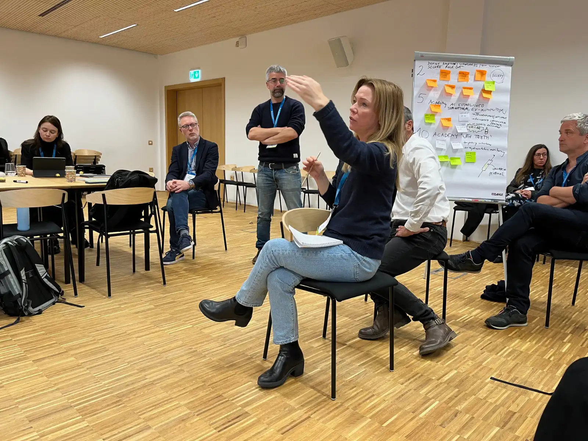

## NEB Academy Pioneer Hub in Slovenia launched
**03-04.04.2024, Izola SI**
The NEB Academy is a flagship initiative on skills for sustainable construction of the European Year of Skills. The first Pioneer Hub is being launched by the University of Primorska in Slovenia together with various institutions across Europe.

===

