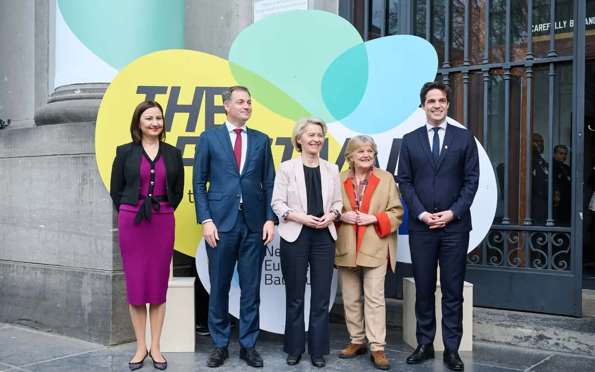

**09.04.2024, Brussels BE**

EC President Ursula von der Leyen, 9 April 2024: "I am proud that tomorrow we will officially launch the New European Bauhaus Academy. It will train a new generation of architects, engineers and construction workers. It will give them the knowledge and the skills they need to turn sustainable materials into beautiful spaces."

[PRESS RELEASE](https://innovawood.sharepoint.com/sites/Innovawood/Shared%20Documents/Forms/AllItems.aspx?id=%2Fsites%2FInnovawood%2FShared%20Documents%2FIW%5FTeam%2F3%5FPlatforms%2FNEB%5FAcademy%2F2%5Fmeetings%2F20240414%5FNEB%5FFestival%2FNEBA%2DAlliance%2Dkick%2Doff%2Dpress%2Drelease%2Dfinal%2Epdf&parent=%2Fsites%2FInnovawood%2FShared%20Documents%2FIW%5FTeam%2F3%5FPlatforms%2FNEB%5FAcademy%2F2%5Fmeetings%2F20240414%5FNEB%5FFestival&p=true&ga=1) of the NEBA Alliance 11 April 2024

Listen to the President's opening speech at the NEB Festival in Brussels.

[button label="Full video" url="https://www.linkedin.com/video/live/urn:li:ugcPost:7183496773728894977/"]

[button label="Full speech text" url="https://ec.europa.eu/commission/presscorner/detail/en/SPEECH_24_1926"]

